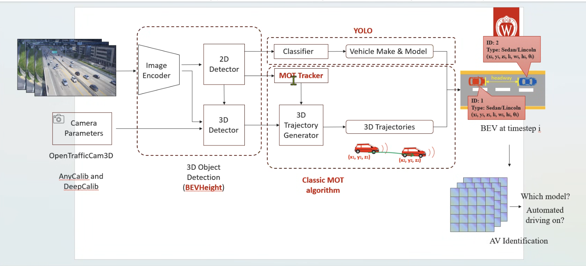

# AV Identification from Roadside 3D Detection

Internal lab project (CATS-Lab). This repo started as a fork of **BEVHeight**
(CVPR 2023) and is being extended toward a different research goal. The original
upstream README is preserved in [`prev-readme.md`](prev-readme.md).

> This README is an internal progress document. It tracks what each component
> does, what is finished, what is parked, and what is next. It is meant for the
> author, advisor, and labmates, not as a public release doc.

---

## Ultimate goal

Take video from a fixed roadside (infrastructure) camera and decide, for each
vehicle in view, whether it is an **autonomous vehicle (AV)** or a
**human-driven** one, purely from how it moves.

The full intended chain:

```
roadside video
  -> per-frame 3D bounding boxes        (BEVHeight detector)
  -> camera calibration                 (intrinsic + extrinsic, so boxes sit correctly in the world)
  -> trajectories                       (associate boxes across frames; position, velocity, acceleration)
  -> AV vs human classification         (behavior analysis on the trajectories)
```

The research bet: AV motion (smoothness, jerk, lane-keeping, reaction timing)
differs measurably from human driving, and that difference is detectable from
external roadside observation in the real world. The closest prior work
(Maresca et al., 2024) does this in simulation only, so the real-world gap is
our contribution.

---

## Architecture



The end-to-end system, read left to right:

1. **Inputs.** A sequence of roadside camera frames, plus **camera parameters**
   (intrinsics + extrinsics). Calibration sources: OpenTrafficCam3D, and our
   learned-intrinsic study (**AnyCalib** / DeepCalib) for cameras with no
   provided calibration.
2. **Image encoder → detectors.** A shared image encoder feeds two heads:
   - a **2D detector → classifier (YOLO)** that reads each vehicle's
     **make & model** (fine-grained vehicle type).
   - a **3D detector (BEVHeight)** that produces 3D boxes (position, size,
     heading) for each vehicle.
3. **3D object detection (BEVHeight).** The per-frame 3D boxes — the geometric
   backbone of everything downstream.
4. **Classic MOT (multi-object tracking).** A **MOT tracker** assigns a stable
   ID to each vehicle across frames; a **3D trajectory generator** links the
   per-frame 3D boxes into **3D trajectories** (x,y,z over time → motion).
5. **BEV at timestep i.** A bird's-eye-view state per frame: each tracked vehicle
   with its ID, type, 3D pose, and inter-vehicle **headway**.
6. **AV identification.** From the stacked BEV/trajectory history, classify each
   vehicle: *which model? is automated driving on?* — the research goal.

Where we are on this diagram: the **calibration** inputs and the **3D detector
(BEVHeight)** are done; the **MOT tracker + 3D trajectory generator** is the next
build; the **2D make/model classifier** and the final **AV identification** stage
are not started. This figure is the reference architecture for the whole project.

---

## Status at a glance

| Component | What it is | Status |
|---|---|---|
| 1. Base detector (BEVHeight) | Vision-based roadside 3D object detection | **Done** (runs on Mac CPU) |
| 2. Camera calibration | Intrinsic + extrinsic estimation/refinement | **Done, parked** (advisor: good enough, 2026-04-27) |
| 3. 3D boxing | Per-frame 3D bounding boxes from images | **Done** (inference works; it is BEVHeight's output) |
| 4. Trajectory extraction | Boxes across frames -> tracks + velocity/accel | **Not started** (planned) |
| 5. AV identification | Classify each track as AV vs human | **Not started** (the actual research question) |

---

## Components

### 1. Base detector: BEVHeight (done, ported to Mac CPU)

BEVHeight is the upstream vision-based roadside 3D detector. It takes RGB images
from a fixed infrastructure camera, lifts image features into a Bird's-Eye-View
grid (Lift-Splat-Shoot), and predicts 3D boxes. It is built for the roadside
viewpoint rather than an ego-vehicle.

**Our work here:** the upstream code only ran on NVIDIA GPUs. We ported the
evaluation/inference path to run on a Mac with no CUDA:

- Replaced the custom CUDA voxel-pooling kernel with a pure-PyTorch
  `scatter_add_` fallback (`ops/voxel_pooling/`).
- Removed/guarded hardcoded `.cuda()` calls (`layers/backbones/lss_fpn.py`,
  `layers/heads/bev_height_head.py`).
- Switched the PyTorch Lightning trainer to single-device CPU in the experiment
  configs (`exps/dair-v2x/...`).

Inference runs and produces KITTI-format metrics. Details:
[`personal-documents/3-18-2026.md`](personal-documents/3-18-2026.md) and
[`personal-documents/3-28-2026.md`](personal-documents/3-28-2026.md).
Checkpoint used: `BEVHeight_R50_128_102.4_65.48_49_epochs.ckpt`.

### 2. Camera calibration (done, parked)

Calibration finds the camera settings needed to relate 3D world points and 2D
image pixels. Two separate things:

- **Intrinsics** (fx, fy, cx, cy): the camera's internal settings (zoom and
  image center). Estimated here by learned models.
- **Extrinsics** (rotation, translation): where the camera sits and points
  relative to the road. Refined here by geometry search, not a learned model.

All calibration code is in [`scripts/calibration/`](scripts/calibration/).
Everything was tested on a **single frame** (`000000`) of the DAIR-V2X-I i-s1
subset. The planned 20-50 frame batch was never run before the phase was parked.

**Intrinsic models compared:**

- **AnyCalib** (ICCV 2025), `run_anycalib_single.py`. Learned, model-agnostic.
  Predicts a per-pixel ray field and recovers the full intrinsics in closed
  form. Input: one RGB image + a camera-model id (`pinhole`). Output:
  [fx, fy, cx, cy]. Variants run: `anycalib_pinhole`, `anycalib_gen`.
- **DeepCalib** (2018), `run_deepcalib_single.py`. Older InceptionV3 net.
  Predicts a single focal + one distortion value from a 299x299 image, which we
  then convert into pinhole intrinsics. See the limitations note at the top of
  that script (it gave a degenerate, saturated result on our roadside view).

**AnyCalib was selected as the intrinsic model.** It estimated the intrinsics
substantially more accurately than DeepCalib, which was trained on
wide-angle/distorted imagery and is out-of-distribution for the narrower roadside
view (its focal estimate saturated at the limit of its output range). DeepCalib's
larger weights were removed during the June cleanup; only the Single-Net
regression weight is retained.

**Extrinsic refinement (orientation only, translation fixed):**

- `road_calibrate_single.py` (object-box proxy): grid-search roll/pitch/yaw to
  minimize the bottom-edge error between projected 3D boxes and 2D labels.
- `road_line_calibrate_single.py` (true road-line): detect lane/road-edge lines,
  map them to the ground plane, grid-search orientation so the lines run
  longitudinal (minimize |dY/dX|).

`visualize_projection_compare.py` renders before/after overlays and IoU metrics.
The road-line method was subsequently refined (orientation-based noise rejection
and a data-driven vanishing-point estimator); see
[`personal-documents/06272026-calibration-improvement.md`](personal-documents/06272026-calibration-improvement.md).

**Status rationale.** Calibration was assessed as an intermediate step and deemed
sufficient for the current pipeline (advisor review, 2026-04-27), with the
direction to prioritise building the end-to-end pipeline before further
optimisation. On DAIR-V2X-I the dataset's ground-truth calibration is used
directly; AnyCalib is retained as the fallback for cameras that ship without
calibration. Context:
[`personal-documents/632206-trajectory-pipeline-todo.md`](personal-documents/632206-trajectory-pipeline-todo.md).

### 3. 3D boxing (done, = BEVHeight output)

The per-frame 3D bounding boxes produced by the detector (class, 3D size,
location, orientation). These are BEVHeight's native output and are already
available through the CPU inference path above; no additional code is required at
this stage. The subsequent phase consumes these boxes.

### 4. Trajectory extraction (not started)

Planned approach (simplest first): take the **centers of the 3D boxes**,
associate them across frames into per-vehicle tracks (start with
nearest-center / IoU matching), and compute **2D/3D position, velocity, and
acceleration** over time. Primary reference for the broader task is below.

### 5. AV identification (not started)

The core research question: classify each trajectory as autonomous or
human-driven. This requires a behavioural feature definition (smoothness, jerk,
lane-keeping, reaction timing), an initial classifier, and a source of
AV-vs-human ground truth. To be scoped with the advisor.

Primary reference: **Maresca et al., "Are you a robot? Detecting Autonomous
Vehicles from Behavior Analysis" (arXiv:2403.09571, 2024)** — same task, but
simulation-only (CARLA). Full review:
[`personal-documents/632206-literature-review.md`](personal-documents/632206-literature-review.md).

---

## Repo layout (what matters for this project)

```
models/, layers/, ops/        BEVHeight detector (backbone, BEV head, voxel pooling)
exps/dair-v2x/, exps/rope3d/  experiment configs (dair-v2x R50_102 is the CPU-patched one)
evaluators/                   KITTI-format evaluation
scripts/calibration/          OUR calibration work (AnyCalib, DeepCalib, road refinement)
scripts/data_converter/       DAIR/Rope3D -> KITTI conversion
external/                     AnyCalib + DeepCalib clones
data/                         DAIR-V2X-I (+ subsets), v2x-c, v2x-v
V2X-Raw-Datasets/             raw infrastructure images (substrate for trajectory phase)
outputs/calibration/          calibration run artifacts (currently sample 000000 only)
personal-documents/           dated working logs and plans (internal)
summary.md                    detailed BEVHeight architecture/summary
```

## Running what works today

BEVHeight CPU evaluation (DAIR-V2X-I, R50 102 config):

```bash
python exps/dair-v2x/bev_height_lss_r50_864_1536_128x128_102.py \
    --ckpt_path ./checkpoints -e -b 1 --gpus 0
```

Calibration on one frame (example):

```bash
# intrinsics (AnyCalib)
python scripts/calibration/run_anycalib_single.py --model-id anycalib_pinhole --cam-id pinhole
# extrinsic road-line refinement using those intrinsics
python scripts/calibration/road_line_calibrate_single.py \
    --pred-json outputs/calibration/anycalib_single/000000_anycalib_pinhole_pinhole.json
```

## Datasets

DAIR-V2X-I (infrastructure side) is the main dataset, with the i-s1 subset used
for the single-frame calibration tests. Raw infrastructure images live in
`V2X-Raw-Datasets/` and are the likely input for the trajectory phase. Datasets
are converted to KITTI format for the detector.

---

## Provenance and credit

This repository is a fork/extension of **BEVHeight** (Yang et al., CVPR 2023).
All detector architecture, configs, and pretrained weights originate from that
work. Our additions are the Mac-CPU port, the calibration study
(`scripts/calibration/`), and the planned trajectory + AV-identification stages.

Built on: [BEVHeight](https://github.com/ADLab-AutoDrive/BEVHeight),
[BEVDepth](https://github.com/Megvii-BaseDetection/BEVDepth),
[DAIR-V2X](https://github.com/AIR-THU/DAIR-V2X),
[AnyCalib](https://github.com/javrtg/AnyCalib), DeepCalib.

```bibtex
@inproceedings{yang2023bevheight,
    title={BEVHeight: A Robust Framework for Vision-based Roadside 3D Object Detection},
    author={Yang, Lei and Yu, Kaicheng and Tang, Tao and Li, Jun and Yuan, Kun and Wang, Li and Zhang, Xinyu and Chen, Peng},
    booktitle={IEEE/CVF Conf.~on Computer Vision and Pattern Recognition (CVPR)},
    month = mar,
    year={2023}
}
```

---

*Note: the original detailed run summaries lived under `summary/`. If that folder
is missing locally it may not have synced; the per-component logs in
`personal-documents/` and `summary.md` cover the same material.*
